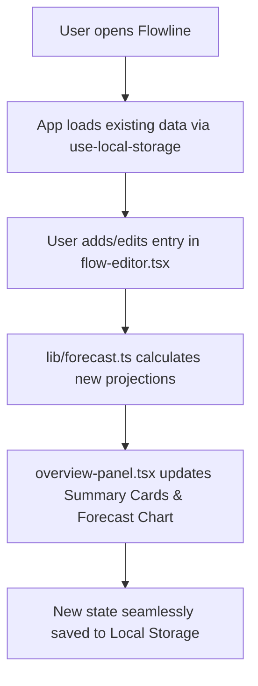
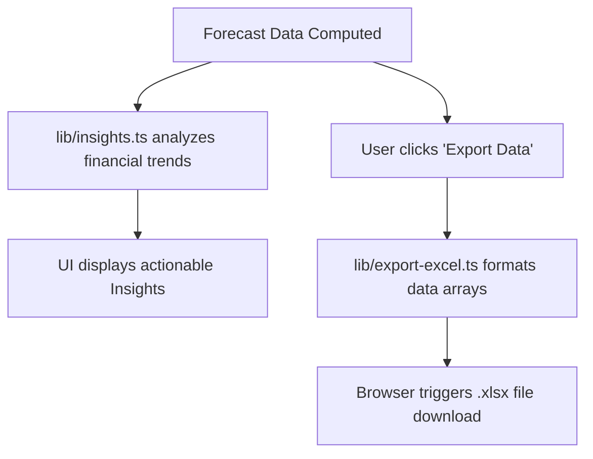

# Flowline: A Cash-Flow Forecaster

## Deployed Website

[Flowline: A Cash-Flow Forecaster](https://flowline-phi.vercel.app/) 

## Planning and Approach

The development of Flowline focused on building a seamless, client-side application for cash-flow projection and financial analysis. The approach prioritized modularity by heavily separating the core mathematical forecasting algorithms and insights generation from the user interface. By leveraging a component-based architecture, the app allows users to interact with a dedicated flow editor, view quick summary cards, and analyze visual forecast charts in a unified, single-page dashboard.

## Architecture Overview & Tech Stack

Flowline is built on a modern, frontend-focused architecture that relies on client-side state management to handle user data without requiring a backend database.

* **Core Framework:** Next.js (utilizing the App Router).

* **Language:** TypeScript for strict static typing.

* **Styling & UI:** Tailwind CSS combined with modular UI components (indicated by `components.json` and the `components/ui/` directory).

* **Package Manager:** pnpm (`pnpm-lock.yaml`).

* **Data Persistence:** Browser Local Storage (`hooks/use-local-storage.ts`).

## Tools, Frameworks, and Libraries Chosen

* **Next.js & React:** Chosen for their robust ecosystem, fast rendering capabilities, and intuitive file-based routing (`app/page.tsx`, `app/layout.tsx`).

* **TypeScript:** Selected to catch errors at compile-time and improve the developer experience. This is especially crucial when handling sensitive financial data and complex logic within the `lib` directory.

* **Tailwind CSS:** Allows for rapid UI prototyping and consistent, responsive styling without leaving the component files (`app/globals.css`, `postcss.config.mjs`).

## Main Technical Decisions and Reasoning

* **Client-Side Storage (`hooks/use-local-storage.ts`):** I decided to store user configuration and cash-flow data directly in the browser's local storage.

* *Reasoning:* This eliminates the need for user authentication or a backend database setup, ensuring the app is instantly accessible, incredibly fast, and keeps the user's financial data completely private.

* **Separation of Logic from UI:** Core functions were isolated into dedicated files like `lib/forecast.ts`, `lib/format.ts`, and `lib/insights.ts`.

* *Reasoning:* This keeps the React components clean and purely focused on presentation. It also ensures the forecasting math is easily testable, debuggable, and maintainable independently of the UI.

* **Built-in Export Functionality (`lib/export-excel.ts`):** Integrated native Excel export capabilities directly into the application.

* *Reasoning:* Users projecting cash flow often need to manipulate data in standard spreadsheet software for presentations or further analysis. Providing a direct export bridges the gap between this app and standard financial workflows.

## Key Feature Flows

### 1. Data Entry & Forecasting Flow

This flowchart illustrates how user inputs are processed and rendered on the screen.

### 2. Insights & Export Flow

This flowchart maps the process of generating automated insights and exporting reports.

## AI Integration and Output Verification

* **Where AI was used:** AI coding assistants were leveraged to scaffold boilerplate Next.js components, generate standard formatting logic (`lib/format.ts`), and assist with constructing the data structures required for the Excel export utility (`lib/export-excel.ts`).

* **How the output was checked:**
* **Type Safety:** All AI-generated code was strictly typed with TypeScript (`tsconfig.json`) and verified against compiler errors.

* **Manual Validation:** The mathematical outputs from `lib/forecast.ts` were extensively cross-referenced with manual spreadsheet calculations to guarantee absolute accuracy in the cash-flow projections.

* **Component Testing:** Evaluated AI-generated UI components (like `forecast-chart.tsx` and `flow-editor.tsx`) locally to ensure they met accessibility standards and rendered correctly on various screen sizes.